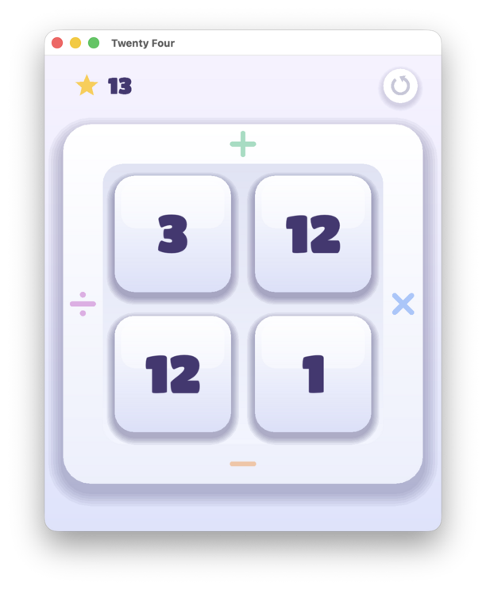

# Twenty Four

A juicy implementation of the 24 arithmetic puzzle: combine four numbers
with `+`, `−`, `×`, and `÷` to make **24**. Written in C++20 with SDL3,
built with CMake. The primary target is an Emscripten Progressive Web App
(PWA) for mobile; desktop (macOS/Linux/Windows) works too.

[**Play or install Twenty Four online**](https://nullprogram.com/twenty-four)



## How to play

Four numbers sit in a 2×2 grid, framed by four operator borders:

```
        +            (top    = add)
   ÷  [a] [b]  ×      (left   = divide,  right = multiply)
      [c] [d]
        −            (bottom = subtract)
```

**Drag one number onto another, then flick toward a border to choose the
operation** — the highlighted border and target show what will happen. Release
to combine them: the two numbers meld into one and the grid shrinks. The
dragged tile is the left operand (`dragged ∘ target`), so to compute `a − b`
drag `a` onto `b` and push down. Division that wouldn't come out even is
rejected (its own sound + a shake); negatives are fine. Reduce all four tiles to
a single **24** to win — confetti, a jingle, and the score ticks up, then a new
puzzle is dealt.

- **Undo** — the circular arrow (top-left) reverses the last move. (Key: `U`.)
- Puzzles are drawn from a shuffled **grab bag** so you see every puzzle once
  before any repeats. Progress, the bag, and the score are saved after every
  move (localStorage on the web; the OS data dir otherwise) and restored on
  launch.

## Building

Dependencies are fetched automatically by CMake (SDL3 over HTTPS, pinned by
SHA256, statically linked). Text uses the vendored single-header
`stb_truetype`; sound effects are synthesised procedurally (no audio assets).

### Desktop

```sh
cmake -B build -DCMAKE_BUILD_TYPE=Release
cmake --build build -j
./build/twenty_four
```

### Web (PWA)

Requires the [Emscripten SDK](https://emscripten.org) (`emcmake` on `PATH`).

```sh
emcmake cmake -B build-web -DCMAKE_BUILD_TYPE=Release
cmake --build build-web -j
# serve the output (service worker needs http://, not file://)
python3 -m http.server -d build-web 8000   # then open http://localhost:8000/index.html

# deploy: copy just the PWA files into a directory (e.g. a gh-pages worktree)
cmake --install build-web --prefix /path/to/gh-pages-worktree
```

The build emits `index.html/.js/.wasm` plus `manifest.webmanifest`, `sw.js`, and
icons — installable and playable offline.

## Puzzles

`solutions.txt` holds every puzzle and one-or-more solutions. At build time
`tools/verify_solutions.py` checks each solution with exact rational arithmetic
(must equal 24 using each number once) and emits the embedded puzzle table
(`puzzles_generated.h`); a bad solution fails the build. Only the puzzles are
embedded — the app has no solution UI. Run it standalone with:

```sh
python3 tools/verify_solutions.py solutions.txt
```

## Layout

| path | purpose |
|------|---------|
| `src/` | game model, rendering, procedural audio, storage, app/input |
| `tools/verify_solutions.py` | solution verifier + puzzle-table generator |
| `web/` | PWA shell, manifest, service worker, icons |
| `assets/font.ttf` | embedded display font (Titan One, OFL) |
| `cmake/EmbedFile.cmake` | turns the font into a C++ byte array |

## License

The project is released into the public domain (see `UNLICENSE`). The bundled
font, Titan One, is licensed under the SIL Open Font License (see
`assets/font-OFL.txt`); `stb_truetype.h` is public domain.
